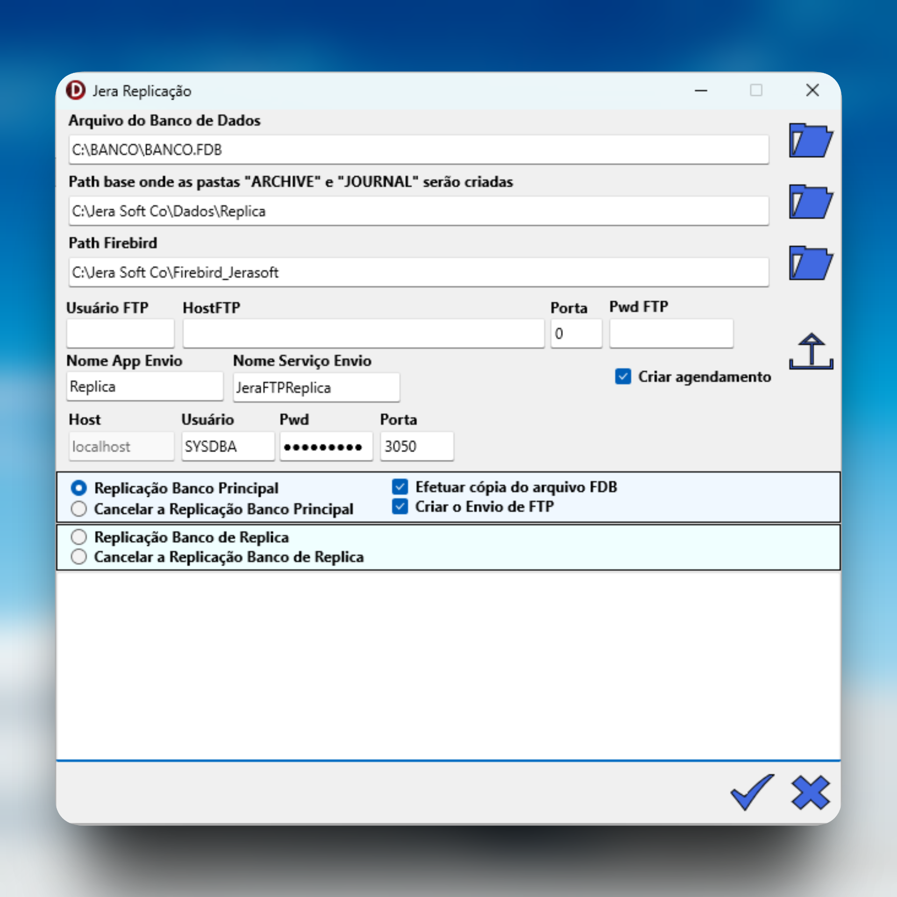

# JeraReplicacaoFB

**App em Delphi para replicação assíncrona de banco de dados Firebird**

Este aplicativo automatiza a configuração de **replicação assíncrona nativa do Firebird 4+ / 5+** baseada em journal segments + archive, ideal para ambientes Windows com alto volume de transações.

### Principais funcionalidades
- Cria pastas JOURNAL e ARCHIVE automaticamente.
- Edita o arquivo `replications.conf` com as configurações necessárias (primário e réplica).
- Executa comandos **GFIX** para habilitar/cancelar replicação (read_only ou read_write).
- Copia o arquivo `.FDB` inicial para sincronização completa (base da réplica).
- Agenda envio periódico dos segmentos arquivados via **WinSCP** (FTP/SFTP/FTPS) a cada 1 minuto pelo Agendador de Tarefas do Windows.
- Apaga segmentos locais após envio bem-sucedido (evita acúmulo).
- Interface gráfica simples e intuitiva (FireMonkey/FMX).

### Requisitos
- **Firebird 4.0 ou superior** (recomendado 5.x) instalado nos dois lados (primário e réplica).
- **Delphi** (qualquer versão recente com suporte a FireMonkey) para compilar ou modificar o código.
- **WinSCP** instalado no servidor primário (para envio dos segmentos via FTP/SFTP).
- Acesso administrativo no Windows (para criar tarefas agendadas e editar arquivos de config do Firebird).
- Banco de dados compatível (ex.: BANCO.FDB).

**Atenção:** A replicação assíncrona do Firebird requer que o banco inicial seja idêntico (cópia física do .FDB). O app faz isso automaticamente.

### Como usar (passo a passo)

1. **Baixe e compile o app**  
   - Clone o repositório:  git clone https://github.com/jerasoftco/jerareplicacaofb.git
   - Abra o projeto `JeraReplicacao.dproj` no Delphi.
- Compile e execute (ou use o executável gerado).

2. **No servidor primário (principal):**
- Execute o app.
- Preencha:
- Caminho do `.FDB` (ex.: `C:\banco\banco.fdb`).
- Pastas JOURNAL e ARCHIVE (o app cria se não existirem).
- Caminho do Firebird (para gfix).
- Configurações FTP (host, usuário, senha, porta) para o servidor da réplica.
- Marque "Criar agendamento" e "Efetuar cópia do arquivo FDB" (se for a primeira vez).
- Clique em **"Replicação Banco Principal"** → o app configura `replications.conf`, cria pastas, agenda o envio e copia o .FDB se necessário.

3. **No servidor réplica:**
- Copie o `.FDB` recebido (o app faz isso via FTP ou manualmente).
- Execute o app novamente (ou use a mesma instância se for o mesmo PC).
- Configure o caminho do .FDB na réplica.
- Clique em **"Replicação Banco de Réplica"** → aplica `gfix -replica read_only` e configura `journal_source_directory` no `replications.conf`.

4. **Verifique o funcionamento:**
- No primário: veja se segmentos (.journal) são criados em JOURNAL → arquivados em ARCHIVE → enviados e deletados.
- No réplica: cheque o arquivo `replication.log` (no diretório do Firebird) para ver o apply dos segmentos.
- Lag típico: 1–3 minutos com agendamento de 1 min.

### Dicas e melhores práticas
- Ative `verbose_logging = true` no `replications.conf` para debug (o app pode adicionar isso).
- Use **SFTP** no WinSCP para segurança (evite FTP plain).
- Teste com carga real (ex.: Jera Soft gerando chamadas/faturas) para ajustar `journal_archive_timeout` se segmentos crescerem rápido.
- Para failover: use `gfix -replica none` manualmente e inverta as configs (planejo adicionar botão para isso).
- Monitore `replication.log` e `firebird.log` para erros.

### Limitações atuais
- Apenas replicação unidirecional (primário → réplica).
- Sem monitoramento automático de lag ou alertas por email (pode ser adicionado).
- Senhas FTP/SYSDBA salvas na config (considere criptografar em futuras versões).

### Contribuições
Sinta-se à vontade para abrir issues, pull requests ou sugerir melhorias!  
Ideias bem-vindas: suporte a SFTP nativo, verificação de checksum, modo bidirecional, logs centralizados.

### Licença
LGPL-2.1 – Veja [LICENSE](LICENSE) para detalhes.

Desenvolvido por **Jera Soft Co. Team** (@jerasoftco) – Minas Gerais, Brasil.

License: LGPL-2.1
